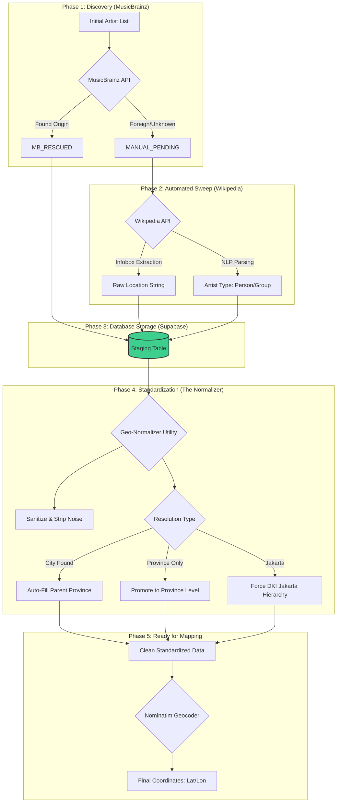

# 🗺️ Indonesian Music Spatial Data Pipeline

This document explains the technical architecture of the data enrichment and standardization process. It tracks how raw artist names are transformed into map-ready spatial coordinates.

---

## 📐 Pipeline Architecture

---

## 🛠️ Component Breakdown

### 1. The Discovery Phase (MusicBrainz)
The first layer of data. We query the MusicBrainz database to find artists who already have a "Begin Area" listed. 
*   **Result**: We recovered many artists automatically but flagged **220+** for deeper research.

### 2. The Sweep Phase (Wikipedia)
For artists missing origin data, we hit the **id.wikipedia.org** API. 
*   **Action**: Extracts data from the **Infobox** (Tempat Lahir/Asal).
*   **Enrichment**: Also classifies the artist as `Person` or `Group` based on the presence of "Anggota" (Members) or "Lahir" (Birth) keywords.

### 3. The Staging Layer (Supabase)
This is where the raw data is accumulated. Before standardization, this table contains "Dirty Data" such as:
*   `Jakarta Selatan`
*   `Jawa Barat` (placed in the City column)
*   `Bandung Regency`

### 4. The Normalizer (Hierarchy Resolution & Standardization)
The `geo_normalizer.py` utility is the most critical logic step. It implements a **Graceful Degradation** strategy to ensure data integrity even when sources are incomplete:

1.  **Sanitization**: Removes "garbage" like citations `[1]`, redundant country suffixes (`, Indonesia`), and administrative noise (*Regency*, *City*, *Kabupaten*).
2.  **Hierarchy Resolution (The "Promotion" Rule)**:
    *   If the source provides only a Province (e.g., `"Jawa Barat"`), the Normalizer "promotes" it: `origin_city` becomes `NULL` and `origin_province` becomes `"Jawa Barat"`. 
    *   *Example*: **Rhoma Irama** was found with "Jawa Barat" in the city column; the Normalizer correctly shifts this to the Province level.
3.  **Parent Mapping (The "Auto-Fill" Rule)**:
    *   If the source provides a specific City (e.g., `"Malang"`), the Normalizer automatically looks up and fills the parent Province (`"Jawa Timur"`).
    *   This ensures that even if Wikipedia only mentions a city, our **Provincial Analytics** (Jakarta vs. Rest of Indonesia) remain accurate.
4.  **The Jakarta Exception**: Standardizes all sub-districts (Jakarta Selatan, Timur, etc.) into a single `Jakarta` city key linked to the `DKI Jakarta` province. This is the foundation of our "Jakarta-Centrism" metrics.

### 5. The Geocoding Phase (Nominatim)
Once the data is standardized, we send the clean strings to the **OpenStreetMap Nominatim** engine. 
*   **Goal**: Obtain precise `Latitude` and `Longitude` for the final spatial visualization.

---

## 📈 Value Proposition
By following this structured pipeline, we ensure that the final **Spatial Dashboard** is accurate, professional, and capable of high-level analytics (e.g., comparing Jakarta's growth vs. the rest of Indonesia).
